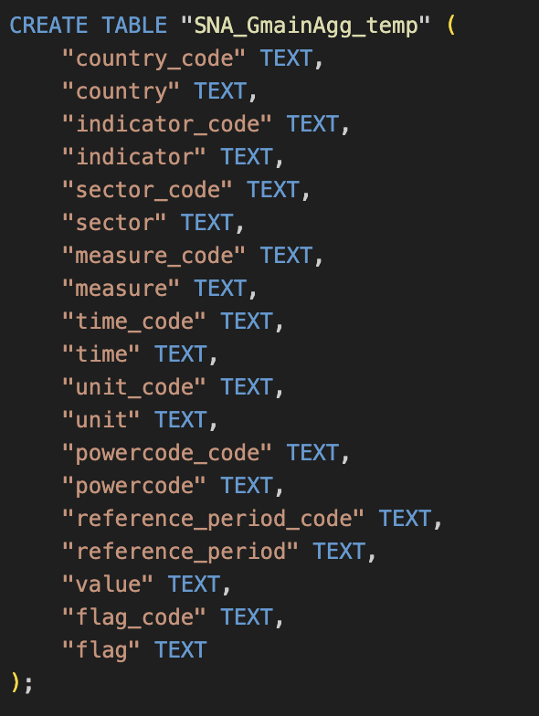
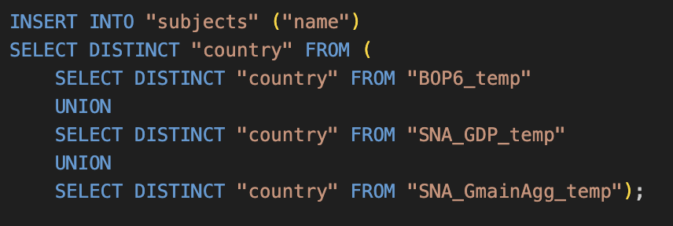
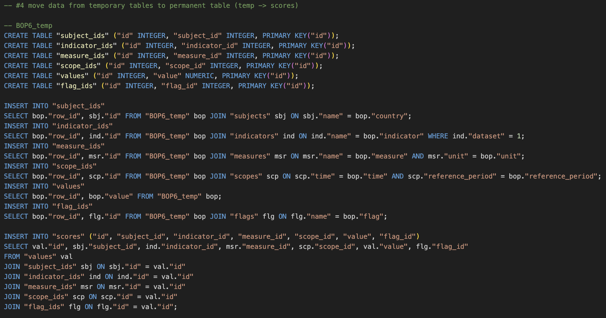
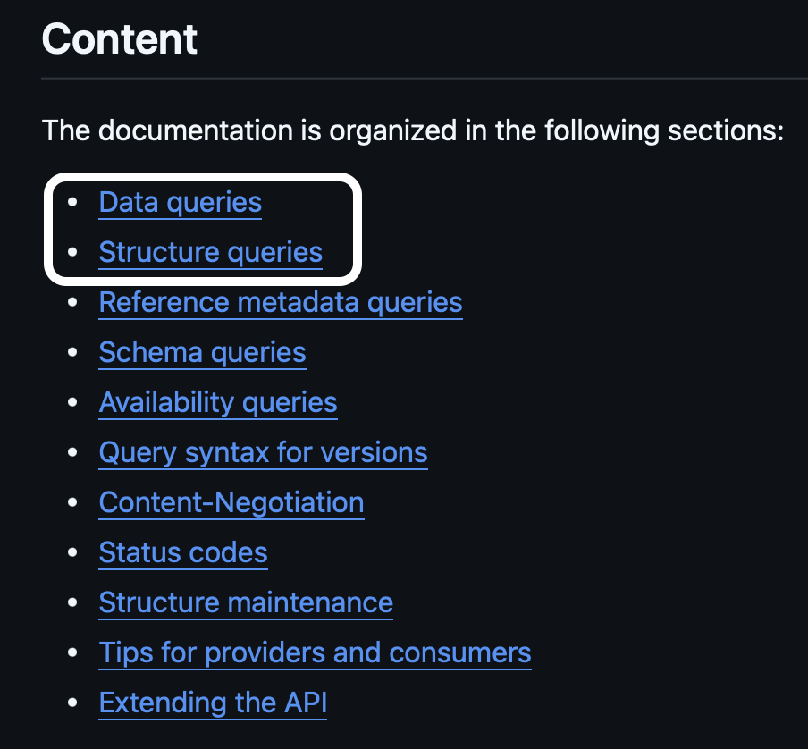

# Design Document

By CANDEA ALEXANDRU-OVIDIU

## Description

&nbsp;&nbsp;&nbsp;&nbsp;The purpose of this project in Python is to seek to overcome some of the limitations encountered in the making of the MacroEconomicsDataBase project/repository:

      "Because of the sheer complexity and amount of statistical data (the OECD SNA:2008 comprises a total of 61 tables!), not all logic was explored and new attributes might have to be added in order to accommodate all the input CSVs."

### Quick recap:

&nbsp;&nbsp;&nbsp;&nbsp;The Macro.db Sqlite3 database is used to store macroeconomic timeseries data, either user defined or fetched from official sources like the OECD. The structure and design of the database is capable of accommodating various datasets in a compact and quickly accessible manner.

<h4>&nbsp;&nbsp;&nbsp;&nbsp;<ins>When just using Sqlite with the ".import" command in order to populate the database, it quickly becomes obvious that in order to do so:</ins></h4>

- each additional CSV file needs to be manually downloaded from the OECD website

 

- after download, each CSV file needs to be stored locally

 

- cleaning and normalizing the data happens inside the DBMS itself, so the CSVs can't be imported directly into permanent tables

 

- in order to be imported, for each CSV file a new temporary table needs to be created for accomodating the data:

 

&nbsp;&nbsp;&nbsp;&nbsp;&nbsp;&nbsp;&nbsp;&nbsp;&nbsp;&nbsp;&nbsp;&nbsp;&nbsp;&nbsp;&nbsp;&nbsp;

 

- each new table might have attribute values that other tables didn't, so the table storing values of that attribute needs to be updated:

 

&nbsp;&nbsp;&nbsp;&nbsp;&nbsp;&nbsp;&nbsp;&nbsp;&nbsp;&nbsp;&nbsp;&nbsp;&nbsp;&nbsp;&nbsp;&nbsp;

 

- moving the data from the temporary tables to the main "scores" table is complicated, not straight forward and prone to error:

 

&nbsp;&nbsp;&nbsp;&nbsp;&nbsp;&nbsp;&nbsp;&nbsp;&nbsp;&nbsp;&nbsp;&nbsp;&nbsp;&nbsp;&nbsp;&nbsp;

 

- a lot of code needs to be duplicated as shown above

 

- the scaling of the database (adding new datasets in batches or one by one) is a cumbersome task

 

- apart from that, a lot of the context of the data is not known, since the CSVs include ony a predefined selection, no fine tuning is possible

  
---------------------------------------------------------------------------------------------------------------------------------------------------------

### 
<ins>The whole process can be automated with Python:</ins>

- ***instead of handling CSVs, let's use RESTful API's to request the data directly from its provider***

- ***SDMX is a set of technical standards for exchange of statistical data and metadata***

- ***SDMX-ML is an implementation of SDMX in XML format, a so-called XML language schema***

- ***<ins>in test_main.py we check that the data we already have in the database is indeed a subset of the data received over API</ins>***

  

## Instructions

1. Install dependencies with:

      `pip3 install -r requirements.txt`

2. Run main.py and follow the instructions prompted

3. In order to formulate valid API calls:

      * Choose a query type:

            * {data}
            * {structure}

      * Additionally for {data} queries:

            * {context}
            * {agencyID}
            * {resourceID}
            * {version}
            * {key}
            * {c}
            * {updatedAfter}&{firstNObservations}&{lastNObservations}&{dimensionAtObservation}&{attributes}&{measures}&{includeHistory}

      * Additionally for {structure} queries:

            * {artefactType}

 

**Tip:** \
First use the {structure} query with the "codelist" {artefactType} in order to get a catalogue of all codes availiable, then use the codes in order to formulate your {data} query. The {context} of your {data} query should be "dataflow", and in this case, the {resourceID} will be a "dataflowID". For a catalogue of availiable dataflows and their IDs, use a {structure} query with the "dataflow" {artefactType}.

**Examples:** 

1. `python3 main.py --shell data dataflow OECD.ENV.EPI DSD_ECH@EXT_DROUGHT 1.0 'AFG.A.ED_CROP_IND.*.*.*.*.*' 'c[TIME_PERIOD]=ge:1981+le:2021&attributes=dsd&measures=all'` 

2. `python3 main.py -s structure dataflow` 

3. `python3 main.py -s structure codelist` 

4. `python3 main.py --interactive` 

5. `python3 main.py -i`

 

For API syntax consult: https://github.com/sdmx-twg/sdmx-rest/blob/master/doc/index.md

 

&nbsp;&nbsp;&nbsp;&nbsp;&nbsp;&nbsp;&nbsp;&nbsp;&nbsp;&nbsp;&nbsp;&nbsp;&nbsp;&nbsp;&nbsp;&nbsp;

